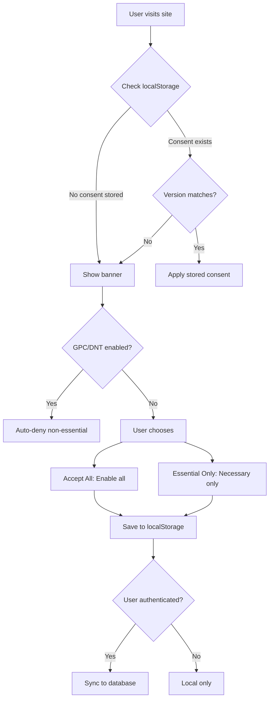

# 🍪 Cookie Consent System - Current State Analysis

**Generated:** January 15, 2026  
**Status:** Phase 1 Analysis Complete

---

## 📋 Executive Summary

Lekbanken has a **solid foundation** for cookie consent management with existing infrastructure including:
- ✅ Basic cookie consent banner component
- ✅ localStorage-based consent storage (for anonymous users)
- ✅ Database tables for authenticated user consent logging
- ✅ Cookie catalog registry
- ✅ GPC/DNT signal detection
- ✅ Multi-language support (EN/NO/SV)
- ✅ Server action for persisting consent

**Gap Analysis Shows:**
- ⚠️ No granular control UI (toggles per category)
- ⚠️ No "Customize" dialog
- ⚠️ Deny button is less prominent (only "Essential only")
- ❌ No consent versioning/re-prompt mechanism
- ❌ No consent audit trail for anonymous users
- ❌ No script conditional loading (GA, marketing)
- ❌ No cookie declaration table on policy page
- ❌ No admin panel for cookie management
- ❌ No consent expiration handling

---

## 🔍 A) Current State Overview

### 1. Existing Files & Components

| File | Purpose | Status |
|------|---------|--------|
| [lib/legal/cookie-consent.ts](lib/legal/cookie-consent.ts) | Core consent logic | ✅ Exists |
| [lib/legal/consent-types.ts](lib/legal/consent-types.ts) | TypeScript types | ✅ Exists |
| [lib/legal/constants.ts](lib/legal/constants.ts) | Constants & defaults | ✅ Exists |
| [lib/legal/types.ts](lib/legal/types.ts) | DB types (CookieConsentRow, etc.) | ✅ Exists |
| [components/legal/CookieConsentBanner.tsx](components/legal/CookieConsentBanner.tsx) | Banner UI | ✅ Exists |
| [app/actions/legal.ts](app/actions/legal.ts) | Server action for consent | ✅ Exists |
| [app/legal/cookie-policy/page.tsx](app/legal/cookie-policy/page.tsx) | Cookie policy page | ✅ Basic |
| [app/providers.tsx](app/providers.tsx) | Banner integration | ✅ Integrated |

### 2. Cookie Categories Defined

```typescript
// From lib/legal/constants.ts
export const COOKIE_CATEGORIES = ['necessary', 'functional', 'analytics', 'marketing'] as const

export const DEFAULT_COOKIE_CONSENT: Record<CookieCategory, boolean> = {
  necessary: true,
  functional: false,
  analytics: false,
  marketing: false,
}
```

### 3. Current Consent Flow



### 4. Database Schema (Existing)

From migration `20260112000000_legal_phase1.sql`:

```sql
-- Cookie catalog (registry of all cookies)
CREATE TABLE IF NOT EXISTS public.cookie_catalog (
  key text PRIMARY KEY,
  category text NOT NULL CHECK (category IN ('necessary','functional','analytics','marketing')),
  purpose text NOT NULL,
  provider text NULL,
  ttl_days int NULL,
  default_on boolean NOT NULL DEFAULT false,
  created_at timestamptz NOT NULL DEFAULT now(),
  updated_at timestamptz NOT NULL DEFAULT now()
);

-- User cookie consents (for authenticated users)
CREATE TABLE IF NOT EXISTS public.cookie_consents (
  id uuid PRIMARY KEY DEFAULT gen_random_uuid(),
  user_id uuid NOT NULL REFERENCES public.users(id) ON DELETE CASCADE,
  cookie_key text NOT NULL REFERENCES public.cookie_catalog(key) ON DELETE CASCADE,
  consent boolean NOT NULL,
  given_at timestamptz NOT NULL DEFAULT now(),
  schema_version int NOT NULL,
  source text NOT NULL CHECK (source IN ('banner','settings')),
  tenant_id_snapshot uuid NULL REFERENCES public.tenants(id) ON DELETE SET NULL,
  UNIQUE(user_id, cookie_key, schema_version)
);
```

**Seeded Cookie Catalog:**
| Key | Category | Purpose |
|-----|----------|---------|
| necessary | necessary | Essential cookies required for core functionality |
| functional | functional | Preferences and enhanced features |
| analytics | analytics | Anonymous usage analytics |
| marketing | marketing | Marketing and advertising tracking |

### 5. Translations (Existing)

**English (en.json):**
```json
"cookieBanner": {
  "title": "We use cookies",
  "description": "We use cookies to keep Lekbanken running and to improve the experience.",
  "acceptAll": "Accept all",
  "acceptNecessary": "Essential only",
  "gpcNotice": "Global Privacy Control/Do Not Track is enabled. We will only use essential cookies."
}
```

**Norwegian (no.json):**
```json
"cookieBanner": {
  "title": "Vi bruker informasjonskapsler",
  "description": "Vi bruker informasjonskapsler for å holde Lekbanken i gang og forbedre opplevelsen.",
  "acceptAll": "Godta alle",
  "acceptNecessary": "Kun nødvendige",
  "gpcNotice": "Global Privacy Control/Do Not Track er aktivert. Vi bruker kun nødvendige informasjonskapsler."
}
```

**Swedish (sv.json):**
```json
"cookieBanner": {
  "title": "Vi använder cookies",
  "description": "Vi använder cookies för att hålla Lekbanken igång och förbättra upplevelsen.",
  "acceptAll": "Godkänn alla",
  "acceptNecessary": "Endast nödvändiga",
  "gpcNotice": "Global Privacy Control/Do Not Track är aktiverat. Vi använder bara nödvändiga cookies."
}
```

---

## 📦 B) Cookie Inventory

### Current Cookies Identified

| Cookie Name | Category | Purpose | Duration | Provider | First/Third Party |
|-------------|----------|---------|----------|----------|-------------------|
| `lb-cookie-consent` | Necessary | Stores consent preferences | 365 days | Lekbanken | First-party |
| `lb-theme` | Necessary | Theme preference (dark/light) | Persistent | Lekbanken | First-party |
| `lb-language` | Necessary | Language preference | Persistent | Lekbanken | First-party |
| `lb_tenant` | Necessary | Current tenant context | Session | Lekbanken | First-party |
| `demo_session_id` | Necessary | Demo session tracking | Session | Lekbanken | First-party |
| `sb-*-auth-token` | Necessary | Supabase authentication | Session | Supabase | First-party |

### Third-Party Scripts Audit

| Script | Category | Current Status | GDPR Compliance |
|--------|----------|----------------|-----------------|
| Vercel Analytics | Analytics | ⚠️ Mentioned in docs | Not integrated |
| Google Analytics | Analytics | ❌ Not found | N/A |
| Facebook Pixel | Marketing | ❌ Not found | N/A |
| LinkedIn Insight | Marketing | ❌ Not found | N/A |
| Hotjar | Preferences | ❌ Not found | N/A |
| Intercom | Preferences | ❌ Not found | N/A |
| Sentry | Necessary | ❌ Not found in frontend | N/A |

**Finding:** No third-party tracking scripts are currently loading. This is GDPR-positive but means analytics features are not available.

---

## ⚠️ C) Gap Analysis

### ✅ What Works Well

1. **GPC/DNT Detection** - `detectPrivacySignals()` correctly detects privacy signals
2. **Schema Versioning** - `COOKIE_CONSENT_SCHEMA_VERSION` allows for re-prompting
3. **LocalStorage + DB Sync** - Consents persist locally and sync for authenticated users
4. **Cookie Catalog** - Database-driven cookie registry allows admin management
5. **Basic Banner** - Functional banner that respects privacy signals
6. **i18n Support** - Translations for NO/SV/EN exist
7. **Necessary Cookie Always True** - `normalizeConsent()` enforces this

### ⚠️ Partially Implemented

1. **Granular Control** - Categories defined but no UI to toggle individually
2. **Cookie Policy Page** - Exists but no declaration table
3. **Consent Expiration** - `COOKIE_CONSENT_RETENTION_DAYS = 365` defined but not enforced

### ❌ Missing Completely

1. **Customize Dialog** - No detailed settings modal
2. **Category Toggles** - No switches per category
3. **Consent Audit Log** - No `cookie_consent_audit` table
4. **Anonymous Consent Tracking** - Only localStorage, no unique ID
5. **Consent Version Migration** - No re-prompt when version changes
6. **Script Conditional Loading** - Analytics/marketing scripts not gated
7. **Cookie Declaration Table** - Auto-generated table from registry
8. **Admin Cookie Management** - No UI to manage cookie_catalog
9. **User Settings Page** - No /app/settings/cookies page
10. **Consent History** - No way for users to see their history
11. **Consent Receipt** - No PDF/export of consent proof

---

## 🔒 D) Compliance Status

### GDPR Article 6(1)(a) - Consent

| Requirement | Status | Notes |
|-------------|--------|-------|
| Freely given consent | ✅ | Two clear options |
| Specific consent | ⚠️ | Categories exist but no UI |
| Informed consent | ✅ | Description provided |
| Unambiguous consent | ✅ | Clear button actions |
| Withdrawable consent | ❌ | No way to change after |
| Documented consent | ⚠️ | Only for auth users |

### ePrivacy Directive

| Requirement | Status | Notes |
|-------------|--------|-------|
| Banner before cookies | ✅ | No scripts load pre-consent |
| Granular control | ❌ | Only all-or-nothing |
| Deny equally prominent | ⚠️ | "Essential only" is smaller |
| No pre-ticked boxes | ✅ | Defaults are false |
| Consent expiration | ❌ | Not enforced |
| Re-consent on changes | ❌ | Version exists but unused |

### Compliance Score: 65/100

**Risks:**
1. 🔴 No way for users to change consent later
2. 🔴 No granular category control
3. 🟡 "Deny" option less prominent than "Accept"
4. 🟡 Anonymous users have no audit trail

---

## 📊 E) Performance Assessment

### Current Impact

- **Bundle Size:** CookieConsentBanner is lightweight (~3KB)
- **No Third-Party Scripts:** Zero external tracking = optimal performance
- **localStorage Read:** Single read on mount (~1ms)
- **No CLS:** Banner positioned fixed, doesn't shift content

### Future Considerations

When adding analytics:
- Google Analytics: +45KB
- GTM: +22KB
- Facebook Pixel: +15KB
- Total potential: ~82KB additional

---

## 🏗️ F) Technical Debt

### Issues to Address

1. **No expiration check** - `expiresAt` not stored in localStorage
2. **Version mismatch handling** - Shows banner but doesn't explain why
3. **No consent ID** - Anonymous users need unique identifier
4. **Missing audit table** - Can't prove compliance for audits
5. **Button import** - Uses `@/components/ui/button` instead of Catalyst

### Code Improvements Needed

```typescript
// Current: No expiration stored
const payload: StoredCookieConsent = {
  schemaVersion: COOKIE_CONSENT_SCHEMA_VERSION,
  categories,
  updatedAt: new Date().toISOString(),
  source,
}

// Needed: Add expiration
const payload: StoredCookieConsent = {
  schemaVersion: COOKIE_CONSENT_SCHEMA_VERSION,
  consentId: generateConsentId(), // NEW
  categories,
  grantedAt: new Date().toISOString(), // RENAMED
  expiresAt: new Date(Date.now() + 365 * 24 * 60 * 60 * 1000).toISOString(), // NEW
  source,
}
```

---

## 🎯 G) Recommendations

### Immediate (Sprint 1)

1. **Add consent expiration check** - Enforce 12-month expiry
2. **Add consent ID** - Unique identifier for all users
3. **Create customize dialog** - Toggles per category
4. **Make Deny equally prominent** - Same size as Accept

### Short-term (Sprint 2-3)

5. **Add cookie declaration table** - Auto-generate from DB
6. **Create user settings page** - /app/settings/cookies
7. **Add consent audit table** - Log all consent events
8. **Implement version re-prompt** - Handle policy changes

### Medium-term (Sprint 4-5)

9. **Admin cookie management** - CRUD for cookie_catalog
10. **Conditional script loading** - Gate analytics on consent
11. **Consent history UI** - Show users their history
12. **Export consent proof** - PDF/JSON receipt

---

## 📁 Files to Create/Modify

### New Files

| File | Purpose |
|------|---------|
| `lib/consent/cookie-consent-manager.ts` | Enhanced consent logic |
| `lib/consent/types.ts` | Extended types |
| `components/cookie/CookieBanner.tsx` | New enterprise banner |
| `components/cookie/CookieSettingsDialog.tsx` | Detailed settings |
| `components/cookie/CookieDeclarationTable.tsx` | Cookie list table |
| `app/app/settings/cookies/page.tsx` | User cookie settings |
| `app/admin/cookies/page.tsx` | Admin cookie management |
| `app/api/consent/log/route.ts` | Consent logging API |
| `supabase/migrations/*_cookie_consent_v2.sql` | Schema enhancements |

### Files to Modify

| File | Changes Needed |
|------|----------------|
| [components/legal/CookieConsentBanner.tsx](components/legal/CookieConsentBanner.tsx) | Add customize dialog, category toggles |
| [lib/legal/cookie-consent.ts](lib/legal/cookie-consent.ts) | Add expiration, consent ID |
| [lib/legal/constants.ts](lib/legal/constants.ts) | Add more constants |
| [app/legal/cookie-policy/page.tsx](app/legal/cookie-policy/page.tsx) | Add declaration table |
| [messages/en.json](messages/en.json) | Expand cookieBanner translations |
| [messages/no.json](messages/no.json) | Expand cookieBanner translations |
| [messages/sv.json](messages/sv.json) | Expand cookieBanner translations |

---

## ✅ Next Steps

Based on this analysis, proceed with:

1. **Enhance existing CookieConsentBanner** with:
   - Customize button → Settings dialog
   - Category toggle switches
   - Equal prominence for Deny
   - Expiration handling

2. **Extend database schema** with:
   - `cookie_consent_audit` table
   - `consent_policy_versions` table
   - Anonymous consent tracking

3. **Add conditional script loading** for:
   - Google Analytics (when added)
   - Marketing pixels (when added)

4. **Create admin panel** at `/admin/cookies` for:
   - Managing cookie_catalog
   - Viewing consent statistics
   - Policy version management

---

*This report was generated as part of the Enterprise Cookie Consent System implementation for Lekbanken.*
