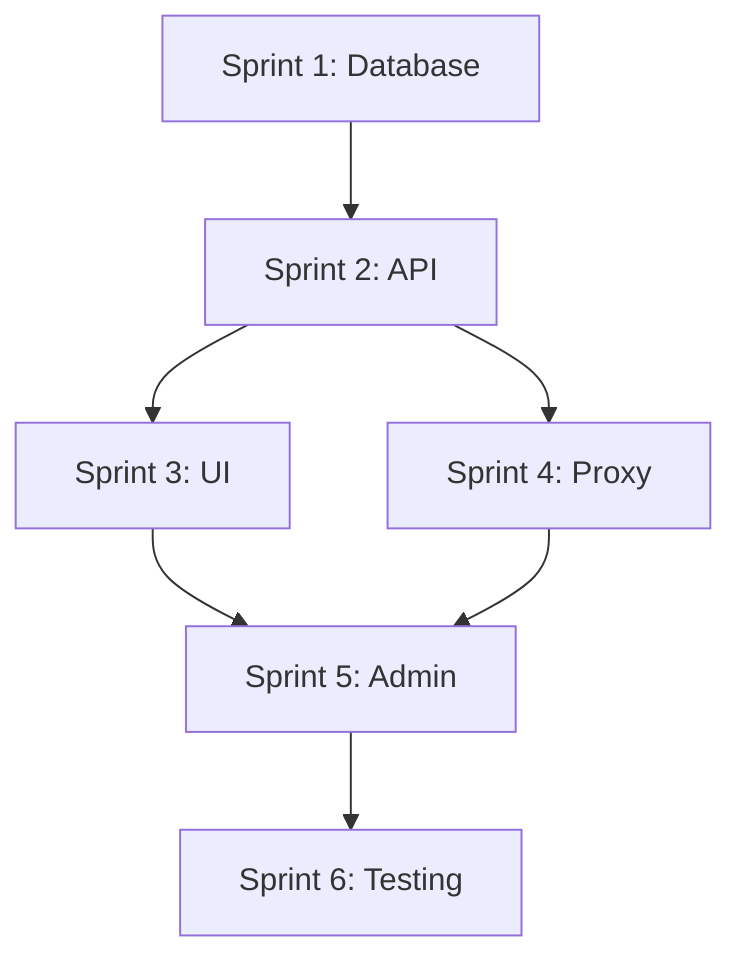

# MFA Implementation Plan för Lekbanken

**Datum:** 2026-01-13  
**Version:** 1.7 (Sprint 5 Complete)  
**Status:** Sprint 1 KLAR ✅ | Sprint 2 KLAR ✅ | Sprint 3 KLAR ✅ | Sprint 4 KLAR ✅ | Sprint 5 KLAR ✅ | Sprint 6 NÄSTA 🔜  
**Uppskattad tid:** 6 sprints (~6 veckor)

---

## 📊 Aktuell Status (2026-01-13)

### ✅ Sprint 1 - Databas & Backend (KLAR)

| Komponent | Status | Fil/Route |
|-----------|--------|-----------|
| Databas-migration | ✅ Klar | `supabase/migrations/20260113200000_mfa_enterprise_foundation.sql` |
| TypeScript-typer | ✅ Klar | `types/mfa.ts` |
| MFA Service | ✅ Klar | `lib/services/mfa/mfaService.server.ts` |
| MFA Audit Service | ✅ Klar | `lib/services/mfa/mfaAudit.server.ts` |
| MFA Guard utility | ✅ Klar | `lib/utils/mfaGuard.ts` |
| MFA Devices Service | ✅ Klar | `lib/services/mfa/mfaDevices.server.ts` |

### ✅ Sprint 2 - API Endpoints (KLAR)

| Komponent | Status | Fil/Route |
|-----------|--------|-----------|
| API: Enroll | ✅ Klar | `/api/accounts/auth/mfa/enroll` |
| API: Verify | ✅ Klar | `/api/accounts/auth/mfa/verify` |
| API: Challenge | ✅ Klar | `/api/accounts/auth/mfa/challenge` |
| API: Status | ✅ Klar | `/api/accounts/auth/mfa/status` |
| API: Disable | ✅ Klar | `/api/accounts/auth/mfa/disable` |
| API: Requirement | ✅ Klar | `/api/accounts/auth/mfa/requirement` |
| API: Recovery Codes | ✅ Klar | `/api/accounts/auth/mfa/recovery-codes` |
| API: Recovery Codes Verify | ✅ Klar | `/api/accounts/auth/mfa/recovery-codes/verify` |
| API: Devices List | ✅ Klar | `/api/accounts/auth/mfa/devices` |
| API: Device Trust | ✅ Klar | `/api/accounts/auth/mfa/devices/trust` |
| API: Device Verify | ✅ Klar | `/api/accounts/auth/mfa/devices/verify` |
| API: Device Revoke | ✅ Klar | `/api/accounts/auth/mfa/devices/[deviceId]` |

### 🚧 Sprint 3 - MFA Challenge UI (KLAR ✅)

| Komponent | Status | Fil/Route |
|-----------|--------|-----------|
| MFA Challenge Page | ✅ Klar | `app/auth/mfa-challenge/page.tsx` |
| MFAChallenge Component | ✅ Klar | `components/auth/MFAChallenge.tsx` |
| MFACodeInput Component | ✅ Klar | `components/auth/MFACodeInput.tsx` |
| MFARecoveryInput Component | ✅ Klar | `components/auth/MFARecoveryInput.tsx` |
| TrustDeviceCheckbox | ✅ Klar | `components/auth/TrustDeviceCheckbox.tsx` |
| useMFAChallenge Hook | ✅ Klar | `hooks/useMFAChallenge.ts` |
| MFA Settings Page | ✅ Klar | `app/app/profile/security/page.tsx` |
| MFA Enrollment Modal | ✅ Klar | `app/app/profile/security/MFAEnrollmentModal.tsx` |

### ✅ Sprint 4 - Proxy Integration (KLAR)

| Komponent | Status | Fil/Route |
|-----------|--------|-----------|
| MFA AAL Helper | ✅ Klar | `lib/auth/mfa-aal.ts` |
| Proxy MFA Enforcement | ✅ Klar | `proxy.ts` (MFA section) |
| Trusted Device Check | ✅ Klar | `lib/auth/mfa-aal.ts` |
| AAL Level Verification | ✅ Klar | `checkMFAStatus()` |
| Grace Period Support | ✅ Klar | Headers x-mfa-grace-* |

### ⏳ Kommande

| Sprint | Innehåll | Status |
|--------|----------|--------|
| Sprint 6 | Testing & Security Audit | 🔜 Nästa |

### ✅ Sprint 5 - Admin Panel (KLAR)

| Komponent | Status | Fil/Route |
|-----------|--------|-----------|
| Tenant MFA Policy Page | ✅ Klar | `app/admin/tenant/[tenantId]/security/mfa/page.tsx` |
| Tenant MFA Policy Client | ✅ Klar | `app/admin/tenant/[tenantId]/security/mfa/TenantMFAPolicyClient.tsx` |
| Tenant MFA Users Page | ✅ Klar | `app/admin/tenant/[tenantId]/security/mfa/users/page.tsx` |
| Tenant MFA Users Client | ✅ Klar | `app/admin/tenant/[tenantId]/security/mfa/users/TenantMFAUsersClient.tsx` |
| API: Tenant Policy | ✅ Klar | `/api/admin/tenant/[tenantId]/mfa/policy` |
| API: Tenant Stats | ✅ Klar | `/api/admin/tenant/[tenantId]/mfa/stats` |
| API: Tenant Users | ✅ Klar | `/api/admin/tenant/[tenantId]/mfa/users` |

---

## 🔐 Säkerhetsmodell (VALD)

### Hybrid MFA Enforcement

Lekbanken använder en **hybridmodell** för MFA:

| Användartyp | MFA-krav | Anledning |
|-------------|----------|-----------|
| **System Admin** | ✅ OBLIGATORISKT | Har tillgång till alla tenants och systemkonfiguration |
| **Tenant Admin (owner/admin)** | ✅ OBLIGATORISKT | Ansvarar för mer än egen användardata |
| **Vanliga användare** | ⭕ VALFRITT | Kan aktivera MFA om de vill |

### Konfiguration via miljövariabler

```bash
# Styr MFA-krav (default: true)
MFA_ENFORCE_ADMINS=true          # Kräv MFA för system_admin
MFA_ENFORCE_TENANT_ADMINS=true   # Kräv MFA för tenant owner/admin
```

---

## 📋 Översikt

Denna plan beskriver hur MFA-systemet ska implementeras i Lekbanken, uppdelat i 6 sprints med tydliga leverabler och beroenden.

### Prioritering

| Prioritet | Kategori | Beskrivning |
|-----------|----------|-------------|
| 🔴 P0 | Critical | Måste finnas för att MFA ska vara säkert |
| 🟠 P1 | High | Viktigt för enterprise-adoption |
| 🟡 P2 | Medium | Förbättrar UX och admin-capabilities |
| 🟢 P3 | Nice-to-have | Framtida förbättringar |

---

## ✅ Sprint 1: Database & Backend Foundation (KLAR)

**Mål:** Skapa databas-infrastruktur för enterprise MFA

### Implementerade filer:

- `supabase/migrations/20260113200000_mfa_enterprise_foundation.sql` - Alla databastabeller
- `types/mfa.ts` - TypeScript-typer
- `lib/services/mfa/mfaService.server.ts` - MFA-tjänst
- `lib/services/mfa/mfaAudit.server.ts` - Audit-loggning
- `lib/utils/mfaGuard.ts` - Uppdaterad för hybridmodell
- `app/api/accounts/auth/mfa/requirement/route.ts` - Ny endpoint
- Uppdaterade: `/enroll`, `/verify`, `/disable`, `/status` routes

### 1.1 Database Migrations

**🔴 P0 - Kritiskt** ✅

#### Migration: Enterprise MFA Foundation
```sql
-- supabase/migrations/20260113200000_mfa_enterprise_foundation.sql

-- Tenant-wide MFA Policy
CREATE TABLE IF NOT EXISTS public.tenant_mfa_policies (
  id UUID PRIMARY KEY DEFAULT gen_random_uuid(),
  tenant_id UUID NOT NULL REFERENCES public.tenants(id) ON DELETE CASCADE,
  
  -- Policy Settings
  is_enforced BOOLEAN NOT NULL DEFAULT false,
  enforcement_level TEXT NOT NULL DEFAULT 'admins_required' 
    CHECK (enforcement_level IN ('optional', 'admins_required', 'all_users')),
  grace_period_days INTEGER NOT NULL DEFAULT 7
    CHECK (grace_period_days >= 0 AND grace_period_days <= 90),
  
  -- Allowed Methods
  allow_totp BOOLEAN NOT NULL DEFAULT true,
  allow_sms BOOLEAN NOT NULL DEFAULT false,
  allow_webauthn BOOLEAN NOT NULL DEFAULT false,
  
  -- Recovery Options
  require_backup_email BOOLEAN NOT NULL DEFAULT false,
  recovery_codes_required BOOLEAN NOT NULL DEFAULT true,
  
  -- Trusted Devices
  allow_trusted_devices BOOLEAN NOT NULL DEFAULT true,
  trusted_device_duration_days INTEGER NOT NULL DEFAULT 30
    CHECK (trusted_device_duration_days >= 1 AND trusted_device_duration_days <= 365),
  
  -- Enforcement Metadata
  enforced_at TIMESTAMPTZ,
  enforced_by UUID REFERENCES auth.users(id),
  
  -- Timestamps
  created_at TIMESTAMPTZ NOT NULL DEFAULT now(),
  updated_at TIMESTAMPTZ NOT NULL DEFAULT now(),
  
  UNIQUE(tenant_id)
);

-- Index
CREATE INDEX IF NOT EXISTS idx_tenant_mfa_policies_tenant 
  ON public.tenant_mfa_policies(tenant_id);

-- RLS
ALTER TABLE public.tenant_mfa_policies ENABLE ROW LEVEL SECURITY;

CREATE POLICY tenant_mfa_policies_select ON public.tenant_mfa_policies
  FOR SELECT TO authenticated
  USING (
    public.is_system_admin()
    OR tenant_id IN (SELECT public.get_user_tenant_ids())
  );

CREATE POLICY tenant_mfa_policies_modify ON public.tenant_mfa_policies
  FOR ALL TO authenticated
  USING (
    public.is_system_admin()
    OR public.has_tenant_role(tenant_id, ARRAY['owner', 'admin']::public.tenant_role_enum[])
  )
  WITH CHECK (
    public.is_system_admin()
    OR public.has_tenant_role(tenant_id, ARRAY['owner', 'admin']::public.tenant_role_enum[])
  );
```

#### Migration 2: Trusted Devices
```sql
-- supabase/migrations/20260113000002_mfa_trusted_devices.sql

CREATE TABLE IF NOT EXISTS public.mfa_trusted_devices (
  id UUID PRIMARY KEY DEFAULT gen_random_uuid(),
  user_id UUID NOT NULL REFERENCES public.users(id) ON DELETE CASCADE,
  tenant_id UUID NOT NULL REFERENCES public.tenants(id) ON DELETE CASCADE,
  
  -- Device Identification
  device_fingerprint TEXT NOT NULL,
  device_name TEXT,
  
  -- Device Metadata
  user_agent TEXT,
  ip_address INET,
  browser TEXT,
  os TEXT,
  
  -- Token for verification (hashed)
  trust_token_hash TEXT NOT NULL,
  
  -- Validity
  trusted_at TIMESTAMPTZ NOT NULL DEFAULT now(),
  expires_at TIMESTAMPTZ NOT NULL,
  last_used_at TIMESTAMPTZ,
  
  -- Status
  is_revoked BOOLEAN NOT NULL DEFAULT false,
  revoked_at TIMESTAMPTZ,
  revoked_reason TEXT,
  
  created_at TIMESTAMPTZ NOT NULL DEFAULT now(),
  
  UNIQUE(user_id, tenant_id, device_fingerprint)
);

-- Indexes
CREATE INDEX IF NOT EXISTS idx_mfa_trusted_devices_user 
  ON public.mfa_trusted_devices(user_id);
CREATE INDEX IF NOT EXISTS idx_mfa_trusted_devices_tenant 
  ON public.mfa_trusted_devices(tenant_id);
CREATE INDEX IF NOT EXISTS idx_mfa_trusted_devices_lookup 
  ON public.mfa_trusted_devices(trust_token_hash) 
  WHERE NOT is_revoked AND expires_at > now();

-- RLS
ALTER TABLE public.mfa_trusted_devices ENABLE ROW LEVEL SECURITY;

CREATE POLICY mfa_trusted_devices_owner ON public.mfa_trusted_devices
  FOR ALL TO authenticated
  USING (
    user_id = auth.uid()
    OR public.is_system_admin()
    OR public.has_tenant_role(tenant_id, ARRAY['owner', 'admin']::public.tenant_role_enum[])
  )
  WITH CHECK (
    user_id = auth.uid()
    OR public.is_system_admin()
  );
```

#### Migration 3: MFA Audit Log
```sql
-- supabase/migrations/20260113000003_mfa_audit_log.sql

CREATE TABLE IF NOT EXISTS public.mfa_audit_log (
  id UUID PRIMARY KEY DEFAULT gen_random_uuid(),
  user_id UUID NOT NULL REFERENCES public.users(id) ON DELETE CASCADE,
  tenant_id UUID REFERENCES public.tenants(id) ON DELETE SET NULL,
  
  event_type TEXT NOT NULL CHECK (event_type IN (
    'enrollment_started', 'enrollment_completed', 'enrollment_cancelled',
    'verification_success', 'verification_failed',
    'disabled_by_user', 'disabled_by_admin',
    'recovery_code_generated', 'recovery_code_used',
    'device_trusted', 'device_revoked',
    'enforcement_triggered', 'grace_period_warning'
  )),
  
  method TEXT CHECK (method IN ('totp', 'recovery_code', 'sms', 'webauthn', NULL)),
  
  ip_address INET,
  user_agent TEXT,
  device_fingerprint TEXT,
  
  success BOOLEAN NOT NULL DEFAULT true,
  failure_reason TEXT,
  failure_count INTEGER,
  
  metadata JSONB DEFAULT '{}'::jsonb,
  created_at TIMESTAMPTZ NOT NULL DEFAULT now()
);

-- Indexes
CREATE INDEX IF NOT EXISTS idx_mfa_audit_log_user 
  ON public.mfa_audit_log(user_id, created_at DESC);
CREATE INDEX IF NOT EXISTS idx_mfa_audit_log_tenant 
  ON public.mfa_audit_log(tenant_id, created_at DESC);
CREATE INDEX IF NOT EXISTS idx_mfa_audit_log_failures 
  ON public.mfa_audit_log(user_id, created_at DESC) 
  WHERE success = false;

-- RLS
ALTER TABLE public.mfa_audit_log ENABLE ROW LEVEL SECURITY;

CREATE POLICY mfa_audit_log_select ON public.mfa_audit_log
  FOR SELECT TO authenticated
  USING (
    user_id = auth.uid()
    OR public.is_system_admin()
    OR (tenant_id IS NOT NULL AND public.has_tenant_role(tenant_id, ARRAY['owner', 'admin']::public.tenant_role_enum[]))
  );

-- Insert allowed for own user
CREATE POLICY mfa_audit_log_insert ON public.mfa_audit_log
  FOR INSERT TO authenticated
  WITH CHECK (user_id = auth.uid());
```

#### Migration 4: Update user_mfa
```sql
-- supabase/migrations/20260113000004_mfa_user_updates.sql

-- Add missing columns
ALTER TABLE public.user_mfa
  ADD COLUMN IF NOT EXISTS tenant_id UUID REFERENCES public.tenants(id) ON DELETE CASCADE,
  ADD COLUMN IF NOT EXISTS backup_email TEXT,
  ADD COLUMN IF NOT EXISTS recovery_codes_count INTEGER DEFAULT 10,
  ADD COLUMN IF NOT EXISTS recovery_codes_used INTEGER DEFAULT 0,
  ADD COLUMN IF NOT EXISTS recovery_codes_generated_at TIMESTAMPTZ,
  ADD COLUMN IF NOT EXISTS notification_preferences JSONB DEFAULT '{"email_on_new_device": true, "email_on_recovery_use": true, "email_on_mfa_disabled": true}'::jsonb,
  ADD COLUMN IF NOT EXISTS grace_period_end TIMESTAMPTZ;

-- Index for tenant lookup
CREATE INDEX IF NOT EXISTS idx_user_mfa_tenant ON public.user_mfa(tenant_id);

-- Backfill tenant_id from primary membership
UPDATE public.user_mfa m
SET tenant_id = (
  SELECT tenant_id FROM public.user_tenant_memberships 
  WHERE user_id = m.user_id AND is_primary = true
  LIMIT 1
)
WHERE m.tenant_id IS NULL;
```

### 1.2 TypeScript Types

**Fil:** `types/mfa.ts`

```typescript
// types/mfa.ts

/**
 * MFA Enforcement Level
 */
export type MFAEnforcementLevel = 'optional' | 'admins_only' | 'all_users';

/**
 * MFA Method Types
 */
export type MFAMethod = 'totp' | 'recovery_code' | 'sms' | 'webauthn';

/**
 * MFA Audit Event Types
 */
export type MFAAuditEventType =
  | 'enrollment_started'
  | 'enrollment_completed'
  | 'enrollment_cancelled'
  | 'verification_success'
  | 'verification_failed'
  | 'disabled_by_user'
  | 'disabled_by_admin'
  | 'recovery_code_generated'
  | 'recovery_code_used'
  | 'device_trusted'
  | 'device_revoked'
  | 'enforcement_triggered'
  | 'grace_period_warning';

/**
 * Tenant MFA Policy
 */
export interface TenantMFAPolicy {
  id: string;
  tenant_id: string;
  is_enforced: boolean;
  enforcement_level: MFAEnforcementLevel;
  grace_period_days: number;
  allow_totp: boolean;
  allow_sms: boolean;
  allow_webauthn: boolean;
  require_backup_email: boolean;
  recovery_codes_required: boolean;
  allow_trusted_devices: boolean;
  trusted_device_duration_days: number;
  enforced_at: string | null;
  enforced_by: string | null;
  created_at: string;
  updated_at: string;
}

/**
 * MFA User Settings
 */
export interface MFAUserSettings {
  user_id: string;
  tenant_id: string | null;
  enforced_reason: string | null;
  enrolled_at: string | null;
  last_verified_at: string | null;
  recovery_codes_hashed: string[] | null;
  recovery_codes_count: number;
  recovery_codes_used: number;
  recovery_codes_generated_at: string | null;
  methods: Record<string, unknown>;
  backup_email: string | null;
  notification_preferences: MFANotificationPreferences;
  grace_period_end: string | null;
  created_at: string;
  updated_at: string;
}

/**
 * MFA Notification Preferences
 */
export interface MFANotificationPreferences {
  email_on_new_device?: boolean;
  email_on_recovery_use?: boolean;
  email_on_mfa_disabled?: boolean;
}

/**
 * Trusted Device
 */
export interface MFATrustedDevice {
  id: string;
  user_id: string;
  tenant_id: string;
  device_fingerprint: string;
  device_name: string | null;
  user_agent: string | null;
  ip_address: string | null;
  browser: string | null;
  os: string | null;
  trusted_at: string;
  expires_at: string;
  last_used_at: string | null;
  is_revoked: boolean;
  revoked_at: string | null;
  revoked_reason: string | null;
  created_at: string;
}

/**
 * MFA Audit Event
 */
export interface MFAAuditEvent {
  id: string;
  user_id: string;
  tenant_id: string | null;
  event_type: MFAAuditEventType;
  method: MFAMethod | null;
  ip_address: string | null;
  user_agent: string | null;
  device_fingerprint: string | null;
  success: boolean;
  failure_reason: string | null;
  failure_count: number | null;
  metadata: Record<string, unknown>;
  created_at: string;
}

/**
 * MFA Status for frontend display
 */
export interface MFAStatus {
  is_enabled: boolean;
  is_required: boolean;
  enrolled_at: string | null;
  last_verified_at: string | null;
  recovery_codes_remaining: number;
  trusted_devices_count: number;
  grace_period_end: string | null;
  days_until_required: number | null;
  factors: {
    totp: boolean;
    sms: boolean;
    webauthn: boolean;
  };
}

/**
 * MFA Requirement Check Result
 */
export interface MFARequirementCheck {
  required: boolean;
  reason: 'tenant_policy' | 'role_based' | 'user_setting' | null;
  enforcement_level: MFAEnforcementLevel | null;
  grace_period_active: boolean;
  days_remaining: number | null;
}

/**
 * MFA Challenge State
 */
export interface MFAChallengeState {
  factor_id: string;
  challenge_id: string;
  expires_at: string;
}

/**
 * Device Trust Request
 */
export interface DeviceTrustRequest {
  device_fingerprint: string;
  device_name?: string;
  user_agent: string;
  ip_address?: string;
}

/**
 * MFA Enrollment Data
 */
export interface MFAEnrollmentData {
  factor_id: string;
  qr_code: string;
  secret: string;
  recovery_codes?: string[];
}
```

### 1.3 Core Service

**Fil:** `lib/services/mfa/mfaService.server.ts`

```typescript
// lib/services/mfa/mfaService.server.ts

import { createServerRlsClient, createServiceRoleClient } from '@/lib/supabase/server';
import { hashRecoveryCodes, verifyRecoveryCode, generateRecoveryCodes } from '@/lib/auth/recovery-codes';
import { logMFAAuditEvent } from './mfaAudit.server';
import type { MFAUserSettings, TenantMFAPolicy, MFARequirementCheck } from '@/types/mfa';

/**
 * Get user's MFA settings
 */
export async function getUserMFASettings(userId: string): Promise<MFAUserSettings | null> {
  const supabase = await createServerRlsClient();
  
  const { data, error } = await supabase
    .from('user_mfa')
    .select('*')
    .eq('user_id', userId)
    .maybeSingle();
  
  if (error) {
    console.error('[MFA] Error getting user settings:', error);
    return null;
  }
  
  return data as MFAUserSettings | null;
}

/**
 * Get tenant MFA policy
 */
export async function getTenantMFAPolicy(tenantId: string): Promise<TenantMFAPolicy | null> {
  const supabase = await createServerRlsClient();
  
  const { data, error } = await supabase
    .from('tenant_mfa_policies')
    .select('*')
    .eq('tenant_id', tenantId)
    .maybeSingle();
  
  if (error) {
    console.error('[MFA] Error getting tenant policy:', error);
    return null;
  }
  
  return data as TenantMFAPolicy | null;
}

/**
 * Check if MFA is required for user
 */
export async function checkMFARequirement(
  userId: string,
  tenantId: string,
  userRole: string
): Promise<MFARequirementCheck> {
  const policy = await getTenantMFAPolicy(tenantId);
  const userSettings = await getUserMFASettings(userId);
  
  // No policy = not required
  if (!policy || !policy.is_enforced) {
    return {
      required: false,
      reason: null,
      enforcement_level: null,
      grace_period_active: false,
      days_remaining: null,
    };
  }
  
  // Check enforcement level
  const isAdmin = ['owner', 'admin', 'editor'].includes(userRole);
  const requiresMFA = 
    policy.enforcement_level === 'all_users' ||
    (policy.enforcement_level === 'admins_only' && isAdmin);
  
  if (!requiresMFA) {
    return {
      required: false,
      reason: null,
      enforcement_level: policy.enforcement_level,
      grace_period_active: false,
      days_remaining: null,
    };
  }
  
  // Check grace period
  if (userSettings?.grace_period_end) {
    const gracePeriodEnd = new Date(userSettings.grace_period_end);
    const now = new Date();
    
    if (now < gracePeriodEnd) {
      const daysRemaining = Math.ceil((gracePeriodEnd.getTime() - now.getTime()) / (1000 * 60 * 60 * 24));
      return {
        required: true,
        reason: 'tenant_policy',
        enforcement_level: policy.enforcement_level,
        grace_period_active: true,
        days_remaining: daysRemaining,
      };
    }
  }
  
  return {
    required: true,
    reason: isAdmin ? 'role_based' : 'tenant_policy',
    enforcement_level: policy.enforcement_level,
    grace_period_active: false,
    days_remaining: null,
  };
}

/**
 * Generate and store recovery codes
 */
export async function generateAndStoreRecoveryCodes(userId: string): Promise<string[]> {
  const supabase = await createServerRlsClient();
  
  // Generate codes
  const codes = generateRecoveryCodes(10);
  const hashedCodes = await hashRecoveryCodes(codes);
  
  // Store hashed codes
  const { error } = await supabase
    .from('user_mfa')
    .upsert({
      user_id: userId,
      recovery_codes_hashed: hashedCodes,
      recovery_codes_count: 10,
      recovery_codes_used: 0,
      recovery_codes_generated_at: new Date().toISOString(),
      updated_at: new Date().toISOString(),
    }, { onConflict: 'user_id' });
  
  if (error) {
    console.error('[MFA] Error storing recovery codes:', error);
    throw new Error('Failed to generate recovery codes');
  }
  
  // Log audit event
  await logMFAAuditEvent(userId, {
    event_type: 'recovery_code_generated',
    success: true,
    metadata: { count: 10 },
  });
  
  return codes;
}

/**
 * Verify and consume a recovery code
 */
export async function verifyAndConsumeRecoveryCode(
  userId: string,
  code: string,
  context?: { ip_address?: string; user_agent?: string }
): Promise<{ success: boolean; remaining: number }> {
  const supabase = await createServerRlsClient();
  
  // Get current codes
  const { data: userMfa, error: fetchError } = await supabase
    .from('user_mfa')
    .select('recovery_codes_hashed, recovery_codes_used, recovery_codes_count')
    .eq('user_id', userId)
    .single();
  
  if (fetchError || !userMfa?.recovery_codes_hashed) {
    await logMFAAuditEvent(userId, {
      event_type: 'recovery_code_used',
      method: 'recovery_code',
      success: false,
      failure_reason: 'No recovery codes found',
      ...context,
    });
    return { success: false, remaining: 0 };
  }
  
  // Verify code
  const matchIndex = await verifyRecoveryCode(code, userMfa.recovery_codes_hashed);
  
  if (matchIndex === -1) {
    await logMFAAuditEvent(userId, {
      event_type: 'recovery_code_used',
      method: 'recovery_code',
      success: false,
      failure_reason: 'Invalid recovery code',
      ...context,
    });
    return { success: false, remaining: userMfa.recovery_codes_count - userMfa.recovery_codes_used };
  }
  
  // Mark code as used (set to empty string)
  const updatedCodes = [...userMfa.recovery_codes_hashed];
  updatedCodes[matchIndex] = '';
  
  const { error: updateError } = await supabase
    .from('user_mfa')
    .update({
      recovery_codes_hashed: updatedCodes,
      recovery_codes_used: userMfa.recovery_codes_used + 1,
      last_verified_at: new Date().toISOString(),
      updated_at: new Date().toISOString(),
    })
    .eq('user_id', userId);
  
  if (updateError) {
    console.error('[MFA] Error updating recovery codes:', updateError);
  }
  
  const remaining = userMfa.recovery_codes_count - (userMfa.recovery_codes_used + 1);
  
  // Log success
  await logMFAAuditEvent(userId, {
    event_type: 'recovery_code_used',
    method: 'recovery_code',
    success: true,
    metadata: { remaining },
    ...context,
  });
  
  // TODO: Send security alert email if notifications enabled
  
  return { success: true, remaining };
}

/**
 * Disable MFA for user (by self or admin)
 */
export async function disableMFA(
  userId: string,
  factorId: string,
  options?: { adminId?: string; reason?: string }
): Promise<void> {
  const isAdminAction = !!options?.adminId;
  const supabase = isAdminAction 
    ? await createServiceRoleClient()
    : await createServerRlsClient();
  
  // Unenroll factor in Supabase Auth
  const { error: unenrollError } = await supabase.auth.mfa.unenroll({ factorId });
  
  if (unenrollError) {
    console.error('[MFA] Error unenrolling factor:', unenrollError);
    throw new Error('Failed to disable MFA');
  }
  
  // Update user_mfa
  const { error: updateError } = await supabase
    .from('user_mfa')
    .update({
      enrolled_at: null,
      enforced_reason: null,
      methods: {},
      updated_at: new Date().toISOString(),
    })
    .eq('user_id', userId);
  
  if (updateError) {
    console.error('[MFA] Error updating user_mfa:', updateError);
  }
  
  // Log audit event
  await logMFAAuditEvent(userId, {
    event_type: isAdminAction ? 'disabled_by_admin' : 'disabled_by_user',
    success: true,
    metadata: isAdminAction ? { admin_id: options.adminId, reason: options.reason } : {},
  });
  
  // TODO: Send notification email
}
```

### 1.4 Audit Service

**Fil:** `lib/services/mfa/mfaAudit.server.ts`

```typescript
// lib/services/mfa/mfaAudit.server.ts

import { createServerRlsClient } from '@/lib/supabase/server';
import type { MFAAuditEventType, MFAMethod } from '@/types/mfa';

export interface MFAAuditEventParams {
  event_type: MFAAuditEventType;
  tenant_id?: string;
  method?: MFAMethod;
  ip_address?: string;
  user_agent?: string;
  device_fingerprint?: string;
  success?: boolean;
  failure_reason?: string;
  failure_count?: number;
  metadata?: Record<string, unknown>;
}

/**
 * Log MFA audit event
 */
export async function logMFAAuditEvent(
  userId: string,
  params: MFAAuditEventParams
): Promise<void> {
  const supabase = await createServerRlsClient();
  
  const { error } = await supabase
    .from('mfa_audit_log')
    .insert({
      user_id: userId,
      tenant_id: params.tenant_id,
      event_type: params.event_type,
      method: params.method,
      ip_address: params.ip_address,
      user_agent: params.user_agent,
      device_fingerprint: params.device_fingerprint,
      success: params.success ?? true,
      failure_reason: params.failure_reason,
      failure_count: params.failure_count,
      metadata: params.metadata ?? {},
    });
  
  if (error) {
    // Don't throw - audit failures shouldn't break main flow
    console.error('[MFA Audit] Failed to log event:', error);
  }
}

/**
 * Get recent failed attempts for rate limiting
 */
export async function getRecentFailedAttempts(
  userId: string,
  windowMinutes: number = 5
): Promise<number> {
  const supabase = await createServerRlsClient();
  
  const windowStart = new Date();
  windowStart.setMinutes(windowStart.getMinutes() - windowMinutes);
  
  const { count, error } = await supabase
    .from('mfa_audit_log')
    .select('id', { count: 'exact', head: true })
    .eq('user_id', userId)
    .eq('success', false)
    .in('event_type', ['verification_failed'])
    .gte('created_at', windowStart.toISOString());
  
  if (error) {
    console.error('[MFA Audit] Error counting failed attempts:', error);
    return 0;
  }
  
  return count ?? 0;
}
```

### 1.5 Recovery Codes Utility

**Fil:** `lib/auth/recovery-codes.ts`

```typescript
// lib/auth/recovery-codes.ts

import bcrypt from 'bcryptjs';
import { randomBytes } from 'crypto';

const BCRYPT_ROUNDS = 12;

/**
 * Generate recovery codes
 * Format: XXXX-XXXX-XXXX (alphanumeric, uppercase)
 */
export function generateRecoveryCodes(count: number = 10): string[] {
  return Array.from({ length: count }, () => {
    const bytes = randomBytes(6);
    const code = bytes.toString('hex').toUpperCase().slice(0, 12);
    return `${code.slice(0, 4)}-${code.slice(4, 8)}-${code.slice(8, 12)}`;
  });
}

/**
 * Hash recovery codes with bcrypt
 */
export async function hashRecoveryCodes(codes: string[]): Promise<string[]> {
  const normalizedCodes = codes.map(c => c.replace(/-/g, '').toUpperCase());
  return Promise.all(
    normalizedCodes.map(code => bcrypt.hash(code, BCRYPT_ROUNDS))
  );
}

/**
 * Verify a recovery code against hashed codes
 * Returns index of matched code or -1 if no match
 */
export async function verifyRecoveryCode(
  code: string,
  hashedCodes: string[]
): Promise<number> {
  const normalizedCode = code.replace(/-/g, '').toUpperCase();
  
  // Filter out already-used codes (empty strings)
  for (let i = 0; i < hashedCodes.length; i++) {
    if (!hashedCodes[i]) continue; // Skip used codes
    
    const isMatch = await bcrypt.compare(normalizedCode, hashedCodes[i]);
    if (isMatch) {
      return i;
    }
  }
  
  return -1;
}
```

### Leverabler Sprint 1

| Fil | Status | Prioritet |
|-----|--------|-----------|
| `supabase/migrations/20260113000001_mfa_tenant_policies.sql` | Skapa | 🔴 P0 |
| `supabase/migrations/20260113000002_mfa_trusted_devices.sql` | Skapa | 🔴 P0 |
| `supabase/migrations/20260113000003_mfa_audit_log.sql` | Skapa | 🔴 P0 |
| `supabase/migrations/20260113000004_mfa_user_updates.sql` | Skapa | 🔴 P0 |
| `types/mfa.ts` | Skapa | 🔴 P0 |
| `lib/services/mfa/mfaService.server.ts` | Skapa | 🔴 P0 |
| `lib/services/mfa/mfaAudit.server.ts` | Skapa | 🔴 P0 |
| `lib/auth/recovery-codes.ts` | Skapa | 🔴 P0 |

---

## 🗓️ Sprint 2: API Endpoints (Vecka 2)

**Mål:** Komplettera MFA API med challenge, recovery och trusted devices

### 2.1 MFA Challenge Endpoint

**Fil:** `app/api/accounts/auth/mfa/challenge/route.ts`

```typescript
// app/api/accounts/auth/mfa/challenge/route.ts

import { NextResponse } from 'next/server';
import { createServerRlsClient } from '@/lib/supabase/server';
import { getRecentFailedAttempts } from '@/lib/services/mfa/mfaAudit.server';

const MAX_ATTEMPTS = 5;
const WINDOW_MINUTES = 5;

export async function POST(request: Request) {
  const supabase = await createServerRlsClient();
  const { data: { user } } = await supabase.auth.getUser();
  
  if (!user) {
    return NextResponse.json({ error: 'Unauthorized' }, { status: 401 });
  }
  
  const body = await request.json().catch(() => ({})) as { factor_id?: string };
  
  if (!body.factor_id) {
    return NextResponse.json({ error: 'factor_id is required' }, { status: 400 });
  }
  
  // Rate limiting check
  const failedAttempts = await getRecentFailedAttempts(user.id, WINDOW_MINUTES);
  if (failedAttempts >= MAX_ATTEMPTS) {
    return NextResponse.json(
      { error: 'Too many attempts. Please try again later.' },
      { status: 429 }
    );
  }
  
  // Create challenge
  const { data, error } = await supabase.auth.mfa.challenge({
    factorId: body.factor_id,
  });
  
  if (error) {
    console.error('[MFA] Challenge creation error:', error);
    return NextResponse.json({ error: 'Failed to create challenge' }, { status: 500 });
  }
  
  return NextResponse.json({
    challenge_id: data.id,
    expires_at: data.expires_at,
  });
}
```

### 2.2 Verify Challenge Endpoint

**Fil:** `app/api/accounts/auth/mfa/verify-challenge/route.ts`

```typescript
// app/api/accounts/auth/mfa/verify-challenge/route.ts

import { NextResponse } from 'next/server';
import { createServerRlsClient } from '@/lib/supabase/server';
import { logMFAAuditEvent, getRecentFailedAttempts } from '@/lib/services/mfa/mfaAudit.server';
import { trustDevice } from '@/lib/services/mfa/mfaDevices.server';
import { headers } from 'next/headers';

const MAX_ATTEMPTS = 5;
const WINDOW_MINUTES = 5;

export async function POST(request: Request) {
  const supabase = await createServerRlsClient();
  const { data: { user } } = await supabase.auth.getUser();
  
  if (!user) {
    return NextResponse.json({ error: 'Unauthorized' }, { status: 401 });
  }
  
  const headersList = await headers();
  const ipAddress = headersList.get('x-forwarded-for')?.split(',')[0] || headersList.get('x-real-ip');
  const userAgent = headersList.get('user-agent');
  
  const body = await request.json().catch(() => ({})) as {
    factor_id?: string;
    challenge_id?: string;
    code?: string;
    trust_device?: boolean;
    device_fingerprint?: string;
    device_name?: string;
  };
  
  if (!body.factor_id || !body.challenge_id || !body.code) {
    return NextResponse.json(
      { error: 'factor_id, challenge_id, and code are required' },
      { status: 400 }
    );
  }
  
  // Rate limiting
  const failedAttempts = await getRecentFailedAttempts(user.id, WINDOW_MINUTES);
  if (failedAttempts >= MAX_ATTEMPTS) {
    return NextResponse.json(
      { error: 'Too many failed attempts. Please try again later.' },
      { status: 429 }
    );
  }
  
  // Verify
  const { error } = await supabase.auth.mfa.verify({
    factorId: body.factor_id,
    challengeId: body.challenge_id,
    code: body.code,
  });
  
  if (error) {
    await logMFAAuditEvent(user.id, {
      event_type: 'verification_failed',
      method: 'totp',
      success: false,
      failure_reason: error.message,
      ip_address: ipAddress ?? undefined,
      user_agent: userAgent ?? undefined,
    });
    
    return NextResponse.json({ error: 'Invalid or expired code' }, { status: 400 });
  }
  
  // Log success
  await logMFAAuditEvent(user.id, {
    event_type: 'verification_success',
    method: 'totp',
    success: true,
    ip_address: ipAddress ?? undefined,
    user_agent: userAgent ?? undefined,
  });
  
  // Update last_verified_at
  await supabase
    .from('user_mfa')
    .update({ last_verified_at: new Date().toISOString() })
    .eq('user_id', user.id);
  
  // Trust device if requested
  let trustToken: string | undefined;
  if (body.trust_device && body.device_fingerprint) {
    const result = await trustDevice(user.id, {
      device_fingerprint: body.device_fingerprint,
      device_name: body.device_name,
      user_agent: userAgent ?? undefined,
      ip_address: ipAddress ?? undefined,
    });
    trustToken = result.trust_token;
  }
  
  return NextResponse.json({
    success: true,
    trust_token: trustToken,
  });
}
```

### 2.3 Recovery Code Verification

**Fil:** `app/api/accounts/auth/mfa/recovery-codes/verify/route.ts`

```typescript
// app/api/accounts/auth/mfa/recovery-codes/verify/route.ts

import { NextResponse } from 'next/server';
import { createServerRlsClient } from '@/lib/supabase/server';
import { verifyAndConsumeRecoveryCode } from '@/lib/services/mfa/mfaService.server';
import { headers } from 'next/headers';

export async function POST(request: Request) {
  const supabase = await createServerRlsClient();
  const { data: { user } } = await supabase.auth.getUser();
  
  if (!user) {
    return NextResponse.json({ error: 'Unauthorized' }, { status: 401 });
  }
  
  const headersList = await headers();
  const ipAddress = headersList.get('x-forwarded-for')?.split(',')[0] || headersList.get('x-real-ip');
  const userAgent = headersList.get('user-agent');
  
  const body = await request.json().catch(() => ({})) as { code?: string };
  
  if (!body.code) {
    return NextResponse.json({ error: 'Recovery code is required' }, { status: 400 });
  }
  
  const result = await verifyAndConsumeRecoveryCode(user.id, body.code, {
    ip_address: ipAddress ?? undefined,
    user_agent: userAgent ?? undefined,
  });
  
  if (!result.success) {
    return NextResponse.json({ error: 'Invalid recovery code' }, { status: 400 });
  }
  
  return NextResponse.json({
    success: true,
    codes_remaining: result.remaining,
  });
}
```

### 2.4 Trusted Devices Service

**Fil:** `lib/services/mfa/mfaDevices.server.ts`

```typescript
// lib/services/mfa/mfaDevices.server.ts

import { createServerRlsClient } from '@/lib/supabase/server';
import { logMFAAuditEvent } from './mfaAudit.server';
import { randomBytes, createHash } from 'crypto';
import type { MFATrustedDevice } from '@/types/mfa';

const DEFAULT_TRUST_DAYS = 30;

/**
 * Generate a secure trust token
 */
function generateTrustToken(): { token: string; hash: string } {
  const token = randomBytes(32).toString('hex');
  const hash = createHash('sha256').update(token).digest('hex');
  return { token, hash };
}

/**
 * Trust a device for MFA bypass
 */
export async function trustDevice(
  userId: string,
  params: {
    device_fingerprint: string;
    device_name?: string;
    user_agent?: string;
    ip_address?: string;
    tenant_id?: string;
  }
): Promise<{ device_id: string; trust_token: string; expires_at: string }> {
  const supabase = await createServerRlsClient();
  
  // Get user's primary tenant if not provided
  let tenantId = params.tenant_id;
  if (!tenantId) {
    const { data: membership } = await supabase
      .from('user_tenant_memberships')
      .select('tenant_id')
      .eq('user_id', userId)
      .eq('is_primary', true)
      .single();
    tenantId = membership?.tenant_id;
  }
  
  if (!tenantId) {
    throw new Error('No tenant context for device trust');
  }
  
  // Generate trust token
  const { token, hash } = generateTrustToken();
  
  // Calculate expiry
  const expiresAt = new Date();
  expiresAt.setDate(expiresAt.getDate() + DEFAULT_TRUST_DAYS);
  
  // Parse user agent for device info
  const browser = parseUserAgentBrowser(params.user_agent);
  const os = parseUserAgentOS(params.user_agent);
  
  // Upsert device (update if fingerprint exists)
  const { data, error } = await supabase
    .from('mfa_trusted_devices')
    .upsert({
      user_id: userId,
      tenant_id: tenantId,
      device_fingerprint: params.device_fingerprint,
      device_name: params.device_name || `${browser} on ${os}`,
      user_agent: params.user_agent,
      ip_address: params.ip_address,
      browser,
      os,
      trust_token_hash: hash,
      trusted_at: new Date().toISOString(),
      expires_at: expiresAt.toISOString(),
      last_used_at: new Date().toISOString(),
      is_revoked: false,
    }, { 
      onConflict: 'user_id,tenant_id,device_fingerprint',
    })
    .select('id')
    .single();
  
  if (error) {
    console.error('[MFA Devices] Error trusting device:', error);
    throw new Error('Failed to trust device');
  }
  
  // Log audit event
  await logMFAAuditEvent(userId, {
    event_type: 'device_trusted',
    tenant_id: tenantId,
    device_fingerprint: params.device_fingerprint,
    ip_address: params.ip_address,
    user_agent: params.user_agent,
    success: true,
    metadata: { device_name: params.device_name, browser, os },
  });
  
  return {
    device_id: data.id,
    trust_token: token,
    expires_at: expiresAt.toISOString(),
  };
}

/**
 * Verify if a device is trusted
 */
export async function verifyTrustedDevice(
  userId: string,
  trustToken: string,
  deviceFingerprint: string
): Promise<{ is_trusted: boolean; device?: MFATrustedDevice }> {
  const supabase = await createServerRlsClient();
  
  // Hash the provided token
  const tokenHash = createHash('sha256').update(trustToken).digest('hex');
  
  // Look up device
  const { data, error } = await supabase
    .from('mfa_trusted_devices')
    .select('*')
    .eq('user_id', userId)
    .eq('trust_token_hash', tokenHash)
    .eq('device_fingerprint', deviceFingerprint)
    .eq('is_revoked', false)
    .gt('expires_at', new Date().toISOString())
    .single();
  
  if (error || !data) {
    return { is_trusted: false };
  }
  
  // Update last_used_at
  await supabase
    .from('mfa_trusted_devices')
    .update({ last_used_at: new Date().toISOString() })
    .eq('id', data.id);
  
  return { is_trusted: true, device: data as MFATrustedDevice };
}

/**
 * Get user's trusted devices
 */
export async function getUserTrustedDevices(userId: string): Promise<MFATrustedDevice[]> {
  const supabase = await createServerRlsClient();
  
  const { data, error } = await supabase
    .from('mfa_trusted_devices')
    .select('*')
    .eq('user_id', userId)
    .eq('is_revoked', false)
    .order('last_used_at', { ascending: false });
  
  if (error) {
    console.error('[MFA Devices] Error listing devices:', error);
    return [];
  }
  
  return data as MFATrustedDevice[];
}

/**
 * Revoke a trusted device
 */
export async function revokeDevice(
  userId: string,
  deviceId: string,
  reason?: string
): Promise<void> {
  const supabase = await createServerRlsClient();
  
  const { data, error } = await supabase
    .from('mfa_trusted_devices')
    .update({
      is_revoked: true,
      revoked_at: new Date().toISOString(),
      revoked_reason: reason,
    })
    .eq('id', deviceId)
    .eq('user_id', userId)
    .select('device_fingerprint')
    .single();
  
  if (error) {
    console.error('[MFA Devices] Error revoking device:', error);
    throw new Error('Failed to revoke device');
  }
  
  // Log audit event
  await logMFAAuditEvent(userId, {
    event_type: 'device_revoked',
    device_fingerprint: data?.device_fingerprint,
    success: true,
    metadata: { reason },
  });
}

// Helper functions
function parseUserAgentBrowser(ua?: string | null): string {
  if (!ua) return 'Unknown';
  if (ua.includes('Firefox')) return 'Firefox';
  if (ua.includes('Chrome')) return 'Chrome';
  if (ua.includes('Safari')) return 'Safari';
  if (ua.includes('Edge')) return 'Edge';
  return 'Unknown';
}

function parseUserAgentOS(ua?: string | null): string {
  if (!ua) return 'Unknown';
  if (ua.includes('Windows')) return 'Windows';
  if (ua.includes('Mac')) return 'macOS';
  if (ua.includes('Linux')) return 'Linux';
  if (ua.includes('Android')) return 'Android';
  if (ua.includes('iOS')) return 'iOS';
  return 'Unknown';
}
```

### Leverabler Sprint 2

| Fil | Status | Prioritet |
|-----|--------|-----------|
| `app/api/accounts/auth/mfa/challenge/route.ts` | Skapa | 🔴 P0 |
| `app/api/accounts/auth/mfa/verify-challenge/route.ts` | Skapa | 🔴 P0 |
| `app/api/accounts/auth/mfa/recovery-codes/verify/route.ts` | Skapa | 🔴 P0 |
| `app/api/accounts/auth/mfa/devices/route.ts` | Skapa | 🟠 P1 |
| `app/api/accounts/auth/mfa/devices/trust/route.ts` | Skapa | 🟠 P1 |
| `app/api/accounts/auth/mfa/devices/verify/route.ts` | Skapa | 🟠 P1 |
| `app/api/accounts/auth/mfa/devices/[deviceId]/route.ts` | Skapa | 🟠 P1 |
| `app/api/accounts/auth/mfa/policy/route.ts` | Skapa | 🟠 P1 |
| `lib/services/mfa/mfaDevices.server.ts` | Skapa | 🟠 P1 |
| Uppdatera befintliga MFA API:er | Modifiera | 🔴 P0 |

---

## 🗓️ Sprint 3: MFA Challenge UI (Vecka 3)

**Mål:** Skapa MFA challenge page och komponenter för login flow

### 3.1 MFA Challenge Page

**Fil:** `app/auth/mfa-challenge/page.tsx`

### 3.2 MFA Challenge Component

**Fil:** `components/auth/MFAChallenge.tsx`

### 3.3 MFA Recovery Input

**Fil:** `components/auth/MFARecoveryInput.tsx`

### 3.4 Trust Device Checkbox

**Fil:** `components/auth/TrustDeviceCheckbox.tsx`

### 3.5 useMFAChallenge Hook

**Fil:** `hooks/useMFAChallenge.ts`

---

## 🗓️ Sprint 4: Proxy Integration (Vecka 4)

**Mål:** Integrera MFA-kontroll i proxy.ts för enforcement

### 4.1 MFA Requirement Check i Proxy

**Modifiera:** `proxy.ts`

### 4.2 AAL Level Check

**Fil:** `lib/auth/mfa-aal.ts`

### 4.3 Trusted Device Cookie Handling

---

## 🗓️ Sprint 5: Admin Panel (Vecka 5)

**Mål:** Admin-gränssnitt för MFA policies och user management

### 5.1 Tenant MFA Policy Page

**Fil:** `app/admin/tenant/[tenantId]/security/mfa/page.tsx`

### 5.2 MFA User Management

**Fil:** `app/admin/tenant/[tenantId]/security/mfa/users/page.tsx`

### 5.3 Admin API Endpoints

---

## 🗓️ Sprint 6: Testing & Security Audit (Vecka 6)

**Mål:** Fullständig testning och säkerhetsvalidering

### 6.1 E2E Tests

**Fil:** `tests/e2e/mfa.spec.ts`

### 6.2 Unit Tests

**Fil:** `tests/unit/mfa-service.test.ts`

### 6.3 Security Checklist

---

## 📊 Dependencies



---

## 🔧 Tekniska Dependencies

```json
{
  "dependencies": {
    "bcryptjs": "^2.4.3"
  },
  "devDependencies": {
    "@types/bcryptjs": "^2.4.6"
  }
}
```

**Installera:**
```bash
npm install bcryptjs
npm install -D @types/bcryptjs
```

---

## ✅ Framgångskriterier

### MVP (Sprint 1-4)
- [x] TOTP enrollment fungerar ✅ (befintligt)
- [ ] MFA challenge vid login
- [ ] Recovery code kan användas vid login
- [ ] Proxy enforcar MFA för tenant policies
- [ ] Rate limiting på MFA verification
- [ ] Audit logging för alla MFA events

### Full Implementation (Sprint 5-6)
- [ ] Admin kan konfigurera tenant MFA policy
- [ ] Admin kan se MFA-status för användare
- [ ] Admin kan återställa användares MFA
- [ ] Trusted devices fungerar
- [ ] E2E-tester passerar
- [ ] Security audit godkänd

---

## 📝 Nästa Steg

1. **Omedelbart:** Skapa Sprint 1 migrations och types
2. **Denna vecka:** Implementera Sprint 1 + Sprint 2
3. **Nästa vecka:** Sprint 3 + Sprint 4 (MFA Challenge UI + Proxy)
